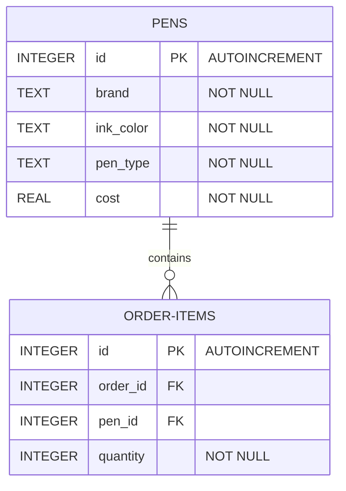

# tubanza_vladimiraldion_labactivity5
Submission 5 for CPE106L

## Overview
The laboratory activity demonstrates the implementation of SQL statements for it table creation. The python file runs the application that accesses the .db file (if there isn't any it will create a new one); It allows the user to input their pen details such as the brand, the color, the pen type, and its cost. The user is also able to modify, view, or delete the data existing on the table.

## How to Run
1. Download the python file on the source folder.
2. Open your command prompt or any terminal environment.
3. Change your directory to where the python file is located using `cd`.
4. Run the following command to start the program: `python tubanza_vladimiraldion_python.py`.
5. Notice: it will create a database `.db` on the current directory.

## AI Usage Disclaimer
I, Vladimir Aldion Tubanza, declare that; Artificial Intelligence (AI) was utilized in the development of this laboratory activity to assist with code generation, terminology query, modifications in the README.md, and structuring the overall process.  All logic, testing, and final implementations were reviewed, verified, and executed by the aforementioned student in accordance to the policy on the Use of AI Tools and Technologies which states that:  It is expected that students will adhere to generally accepted standards of academic honesty, including but not limited
to refraining from cheating, plagiarizing, misrepresenting one’s work, and/or inappropriately collaborating. This includes the use of generative AI tools that have not been cited or documented or authorized. Students will also be
expected to adhere to the prescribed professional and ethical standards of the profession/discipline for which the
student is preparing. Any student who engages in academic dishonesty or who violates the professional and ethical
standards for the profession/discipline for which the students is preparing, may be subject to academic sanctions as
the University’s academic Integrity Policy. 

  

